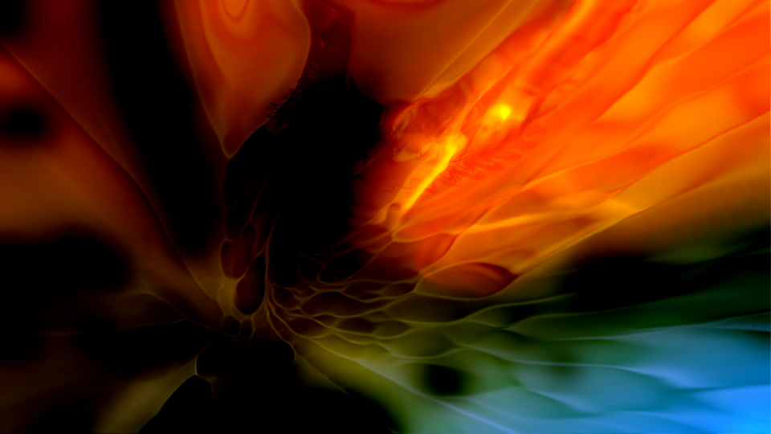

# Omadrop

Music visuals for Omarchy, with 21 curated MilkDrop presets and audio response
adapted to each scene. Album artwork opens the show, then dissolves into glass,
fluid surfaces, fractals, particles and light.



This checkout is the **0.4.0 release candidate**. The published release remains
[v0.3.0](https://github.com/btsouth/omadrop/releases/tag/v0.3.0).

## What it does

- Captures the audio playing through PipeWire, locally.
- Adds continuous low, mid, high and timbral response to authored MilkDrop visuals.
- Shows available MPRIS album artwork for 3.5 seconds, then dissolves into a scene.
- Rotates through the collection with shuffled selection and blended transitions.
- Supports one or multiple displays, with shared scene changes and controls.
- Remembers display choice and audio timing for each output device.

The visuals use projectM 4.1.7 with a small Omadrop audio-input extension. Original
preset shaders, PCM response and feedback remain. Frequency bands are not
isolated instruments. Preset loading can still cause occasional short stalls.

## Install

Build from this checkout:

```sh
./install.sh
```

The installer adds Arch dependencies, builds pinned projectM source, stages the
complete runtime, and installs it under `~/.local/share/omadrop`. An existing
installation is preserved in a sibling `omadrop.previous.*` directory. Close
Omadrop before updating. Settings and cached artwork stay in place.

Use `--no-deps` to manage dependencies yourself or `--no-bindings` to leave
keyboard shortcuts alone. Build requirements include GCC, Git, Python, CMake,
Ninja, pkgconf, SDL2, GLEW, libpng, FFTW, json-c and libprojectm. Runtime helpers
include PipeWire, PulseAudio utilities, ImageMagick, GLib, curl and jq.

## Use

```sh
omadrop                 # launch, or close an already running instance
omadrop --single        # use one display and remember it
omadrop --all           # use all displays and remember it
omadrop --single --original  # start with added audio response disabled
omadrop calibrate       # adjust timing for the current audio output
```

| Key | Action |
| --- | --- |
| Super + Shift + V | Toggle Omadrop |
| Super + Alt + V | Toggle the secondary display |
| N / P | Next / previous preset |
| O | Toggle Omadrop's added audio response |
| A | Toggle ASCII rendering |
| [ / ] | Move audio timing by 10 ms |
| F11 | Toggle fullscreen |
| Esc | Close |

The native scene editor and its scene packs remain available through
`omadrop pack`. Native favorites, hidden scenes and director profiles do not
apply to the MilkDrop collection. See [controls](docs/controls.md).

## Check and remove

```sh
omadrop-doctor
./bin/omadrop-check
./bin/omadrop-check --full
~/.local/share/omadrop/uninstall.sh
```

The full check loads all 21 presets and exercises a longer rotation. Installation
and package checks use isolated paths. Development details are in
[release engineering](docs/releasing.md).

## Credits

The collection preserves work by the original MilkDrop artists, including Geiss,
Martin, Flexi and their collaborators. Omadrop adds curation, desktop integration
and audio adaptations. [All presets and notices](THIRD_PARTY_NOTICES.md).

Omadrop code is MIT licensed. projectM is LGPL licensed. Presets and textures
retain their original authorship and rights; they are not covered by Omadrop's
MIT license. projectM is an independent project.
