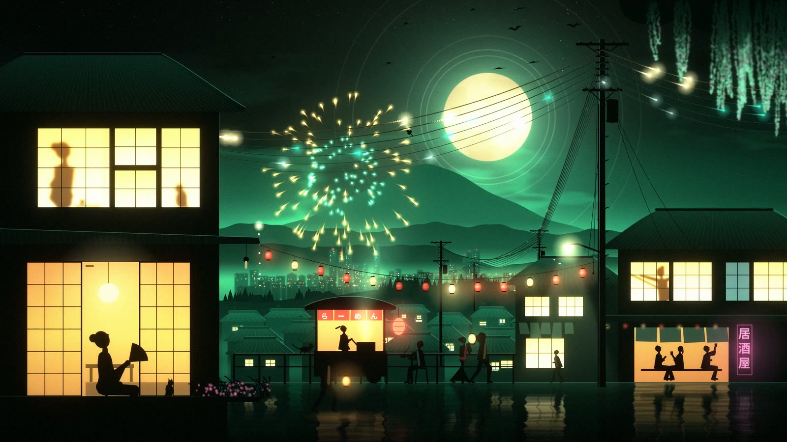

# Omadrop

**MilkDrop and living worlds for Omarchy, wired to your music.**

21 hand-picked MilkDrop presets and living worlds that react to your music:
Osaka Jade, a night street, and Kanagawa, a Hokusai great wave. Play music in
any app, open Omadrop, and go fullscreen.

[](https://github.com/btsouth/omadrop/releases/download/v0.5.0/omadrop-v0.5.0-demo.mp4)

[See it with music at omadrop.com](https://omadrop.com) · [Watch the MilkDrop launch video](https://github.com/btsouth/omadrop/releases/download/v0.5.0/omadrop-v0.5.0-demo.mp4) · [Latest release](https://github.com/btsouth/omadrop/releases/latest)

## Install

For Omarchy on Arch Linux, x86_64:

```sh
curl -fsSL https://pkgs.btso.dev/install.sh | bash -s -- omadrop
```

Open **Omadrop** from the app launcher, or run `omadrop`.
The command adds my [signed package repository](https://github.com/btsouth/pkgs),
so Omadrop then updates with the rest of your system (`omarchy update` or
`sudo pacman -Syu`). If you installed an earlier release by hand, run the same
command to start getting updates.
Pacman installs the dependencies. The package does not change your Hyprland shortcuts.

## Pick a scene. Press Play.


The controls follow your Omarchy theme. Click a thumbnail to start with that
scene, or press Play for a shuffled rotation with blended transitions.
Esc brings you back to the controls.

- **21 MilkDrop presets.** Original shaders, feedback and textures, with added
  response to frequencies, transients and musical changes.
- **ASCII mode.** A dot filter with previews in the thumbnail grid.
- **Your collection.** Hide scenes you want to skip and toggle scene names.
- **Your output.** Play on one display or all displays, with audio timing
  adjustment for Bluetooth and other outputs.
- **Local audio.** Captures what is playing through PipeWire. No account or
  cloud service.

<p>
  
  
</p>
<p><sub>Liquid Ice · Neon Orbits in ASCII</sub></p>



**Omarchy mode** plays Osaka Jade: a living street with music-reactive lights,
residents and fireworks that answer loud songs. Each launch gets its own
timeline, so trains, cyclists and the people on the street come back at
different moments. It plays with every Omarchy theme. MilkDrop stays the
default; Esc returns to controls in either mode.

## Controls

| Key | MilkDrop |
| --- | --- |
| Esc | Return to controls |
| N / P | Next / previous scene |
| A | Toggle ASCII |
| O | Toggle added audio response |
| [ / ] | Adjust audio timing by 10 ms |
| F11 | Toggle fullscreen |

See [all controls and commands](docs/controls.md).

## Build from source

```sh
git clone https://github.com/btsouth/omadrop.git
cd omadrop
packaging/makepkg.sh -si
```

Or use `./install.sh` for a user installation. See
[building and testing](docs/building.md) and [contributing](CONTRIBUTING.md).
Omadrop needs Hyprland, PipeWire and an OpenGL 3.3 capable GPU. Omarchy mode
plays the world you pick, Osaka Jade or Kanagawa, on one display or all displays.

## Help build living worlds

The goal is a living world for every Omarchy theme, and eventually a Journey
mode that travels between them. Artists, theme authors and developers can use
the starter template and commands to [build a living world](docs/worlds.md) in
the style of Osaka Jade. The plan, and the place to say you want in, is
[Living worlds: contributor kit](https://github.com/btsouth/omadrop/issues/6).

## Credits

Omadrop code is [MIT licensed](LICENSE). MilkDrop presets and textures retain
their original authors' rights. Neon Orbits is based on Serge + martin's
`crystal palace010`; Liquid Ice is based on Flexi's `crush ice 62`.

The launch video uses **“We Can Fix Everything” by Kevin Koontz
([@koozeex1](https://x.com/koozeex1))**.

Full preset credits and notices for projectM and
other dependencies are in [THIRD_PARTY_NOTICES.md](THIRD_PARTY_NOTICES.md).
[Report a bug or request a credit correction](https://github.com/btsouth/omadrop/issues).
