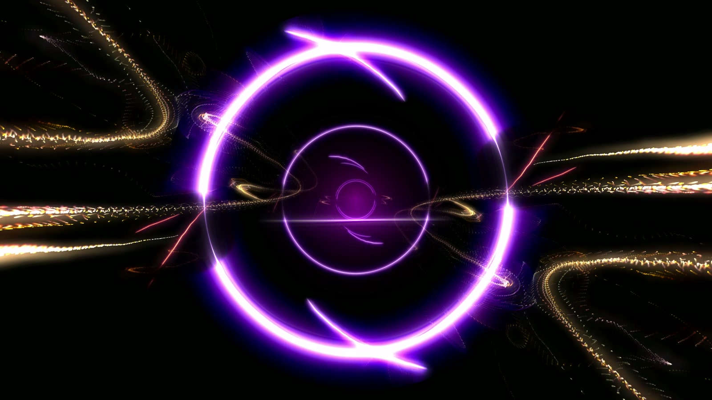
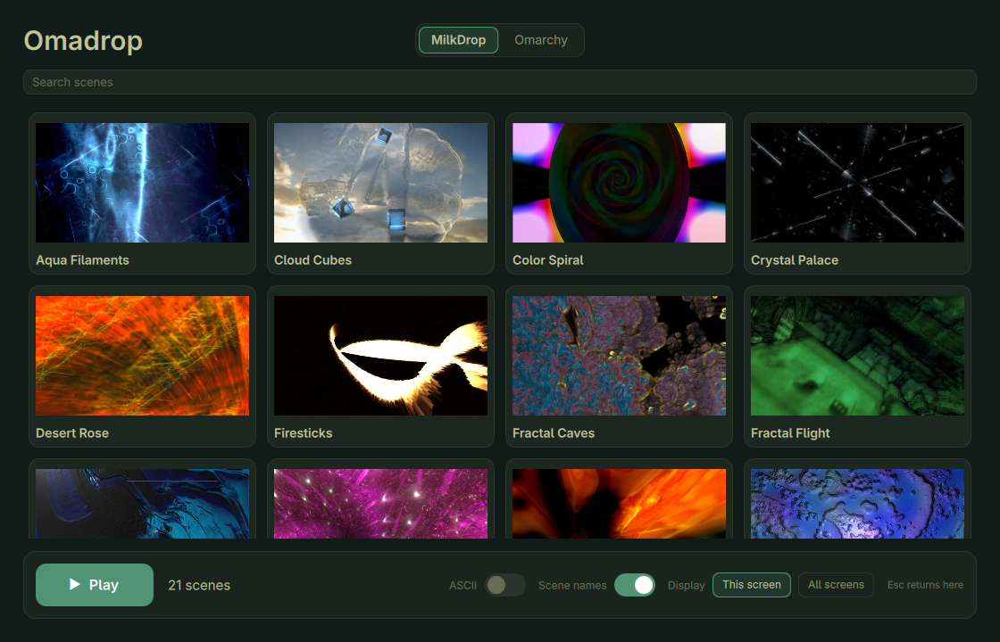
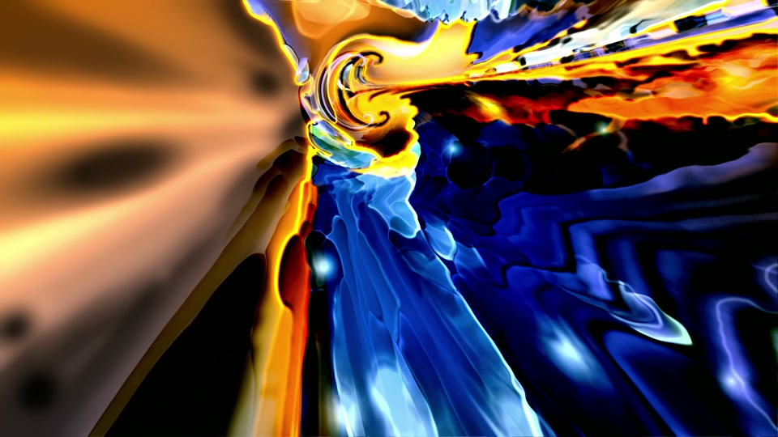
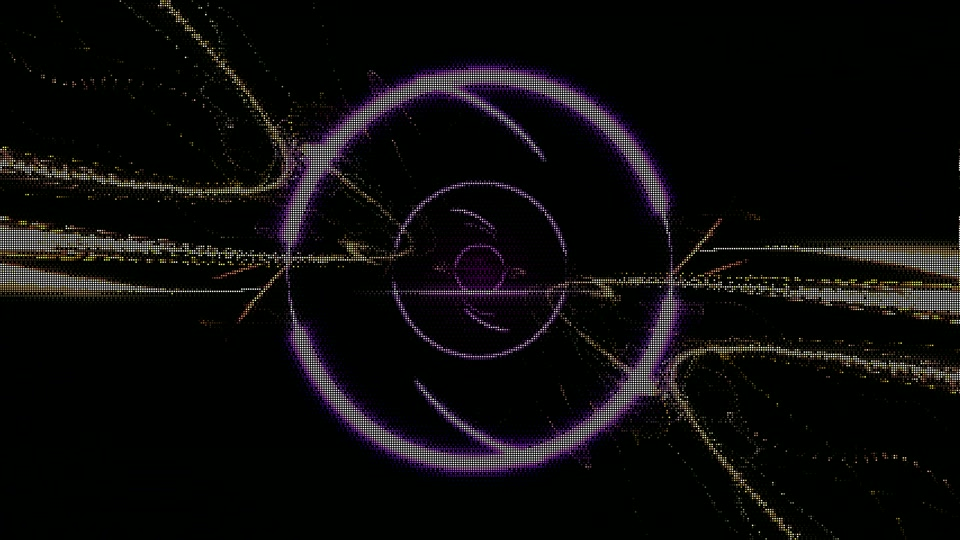

# Omadrop

**MilkDrop for Omarchy, wired to your music.**

21 hand-picked MilkDrop presets, each connected to Omadrop's audio engine.
Play music in any app, open Omadrop, and go fullscreen.

[](https://github.com/btsouth/omadrop/releases/download/v0.5.0/omadrop-v0.5.0-demo.mp4)

[Watch the launch video](https://github.com/btsouth/omadrop/releases/download/v0.5.0/omadrop-v0.5.0-demo.mp4) · [Download v0.5.0](https://github.com/btsouth/omadrop/releases/tag/v0.5.0)

## Install

For Omarchy on Arch Linux, x86_64:

```sh
curl -fLO https://github.com/btsouth/omadrop/releases/download/v0.5.0/omadrop-0.5.0-1-x86_64.pkg.tar.zst
sudo pacman -U omadrop-0.5.0-1-x86_64.pkg.tar.zst
```

Open **Omadrop** from the app launcher, or run `omadrop`.
Close the app before updating. Package dependencies are installed by pacman;
the package does not change your Hyprland shortcuts.

## Pick a scene. Press Play.



The controls follow your Omarchy theme. Click a thumbnail to start with that
scene, or press Play for a shuffled rotation with blended transitions.
Esc brings you back to the controls.

- **21 MilkDrop presets.** Original shaders, feedback and textures, with added
  response to frequencies, transients and musical changes.
- **ASCII mode.** A dot filter with previews in the thumbnail grid.
- **Your collection.** Hide scenes you want to skip and toggle scene names.
- **Your output.** Play on one display or all displays, with audio timing
  adjustment for Bluetooth and other outputs.
- **Local audio.** Captures what is playing through PipeWire. No account or
  cloud service.

<p>
  
  
</p>
<p><sub>Liquid Ice · Neon Orbits in ASCII</sub></p>

Omadrop also includes an **early Omarchy mode** with 37 music-driven terminal
effects from the Omarchy screensaver. MilkDrop is the main attraction in this release.

## Controls

| Key | MilkDrop |
| --- | --- |
| Esc | Return to controls |
| N / P | Next / previous scene |
| A | Toggle ASCII |
| O | Toggle added audio response |
| [ / ] | Adjust audio timing by 10 ms |
| F11 | Toggle fullscreen |

See [all controls and commands](docs/controls.md).

## Build from source

```sh
git clone https://github.com/btsouth/omadrop.git
cd omadrop
packaging/makepkg.sh -si
```

Or use `./install.sh` for a user installation. See
[building and testing](docs/building.md) and [contributing](CONTRIBUTING.md).
Omadrop needs Hyprland, PipeWire and an OpenGL 3.3 capable GPU. Omarchy mode
uses Ghostty by default; other supported terminals are listed in the package.

## Credits

Omadrop code is [MIT licensed](LICENSE). MilkDrop presets and textures retain
their original authors' rights. Neon Orbits is based on Serge + martin's
`crystal palace010`; Liquid Ice is based on Flexi's `crush ice 62`.

The launch video uses **“We Can Fix Everything” by Kevin Koontz
([@koozeex1](https://x.com/koozeex1))**.

Full preset credits and notices for projectM, ttfx, TerminalTextEffects and
other dependencies are in [THIRD_PARTY_NOTICES.md](THIRD_PARTY_NOTICES.md).
[Report a bug or request a credit correction](https://github.com/btsouth/omadrop/issues).
